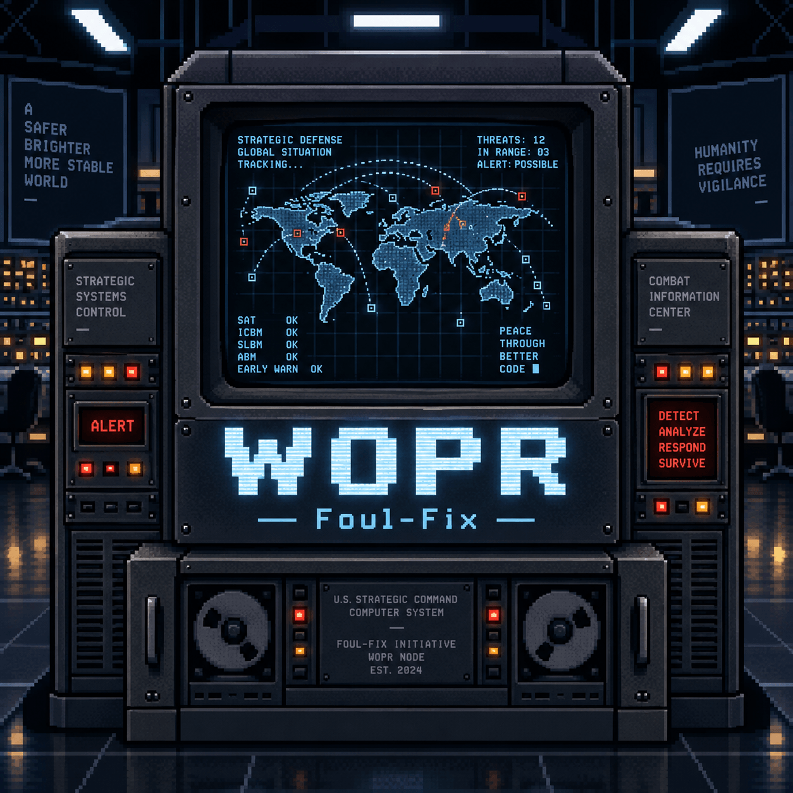

  
  

# WOPR

**Workflow d’Organisation et de Pilotage des Réparations**

WOPR est une application locale de gestion d’atelier pour suivre les réparations, clients, devis, factures, encaissements, restitutions, achats, justificatifs et tâches administratives.

**Version documentée : 2.3.206**

> Développé par Foul-Fix, avec l’aide de ChatGPT (OpenAI) pour l’assistance au développement, à la documentation et aux tests.

## Fonctions principales

- tableau de bord Atelier ;
- création et suivi des réparations ;
- facturation et factures simples ;
- devis ;
- gestion clients et historique ;
- imports/exports de contacts et Google Contacts ;
- achats / ventes et justificatifs fournisseurs ;
- suivi Antivirus ;
- intégration Abby ;
- CA / Déclarations ;
- e-mails via SMTP et messages client ;
- sécurité locale, sauvegardes et diagnostic de portabilité ;
- PDF multilingues.

### Windows

Le lanceur `WOPR-Windows.vbs` affiche désormais une fenêtre de progression pendant l’initialisation, évite les doubles lancements et n’ouvre le navigateur qu’une fois WOPR prêt. La navigation s’adapte également aux écrans portables, en mode normal comme en 8-bit.

## Documentation

- [Manuel complet en Markdown](docs/manuel.md)
- [Documentation HTML](docs/index.html)
- [Manuel PDF](docs/WOPR-Manuel.pdf)
- [Historique de la documentation](docs/CHANGELOG-DOC.md)

## Confidentialité avant publication

Le dossier **`private/` ne doit jamais être publié**. Il peut contenir la base, des clients, documents, sauvegardes, signatures, secrets et paramètres locaux.

Consulte aussi [`GITHUB-PUBLICATION.md`](GITHUB-PUBLICATION.md) avant le premier push public.

## Licence

Aucune licence n’est imposée dans ce pack. Choisis et ajoute une `LICENSE` avant une publication open source si tu souhaites autoriser la réutilisation du code.
