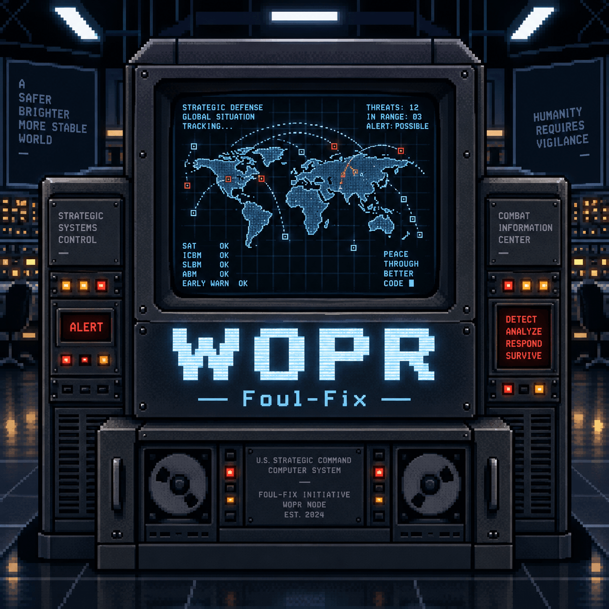

  
  

# WOPR

**Workflow d’Organisation et de Pilotage des Réparations**

**100 % gratuit et open source - GNU GPLv3**

WOPR est une application locale de gestion d’atelier conçue pour centraliser le suivi des réparations, les clients, devis, factures, encaissements, achats, justificatifs, stock de composants et tâches administratives.

**Version documentée : 2.6.1**

> Développé avec l’aide de ChatGPT (OpenAI) pour l’assistance au développement, à la documentation et aux tests.

## Principales fonctions

- Tableau de bord Atelier avec vue rapide des dossiers en cours, attentes pièce, restitutions, impayés et activité du mois.
- Gestion complète des réparations : création, diagnostic, suivi, statut, remarques, facturation et restitution.
- Mode Client permettant d’utiliser l’interface devant un client sans afficher les informations confidentielles.
- Gestion des clients avec recherche, archivage, coordonnées et intégrations optionnelles.
- Devis et factures PDF, factures simples et historique des règlements.
- Gestion des paiements fractionnés et rapprochement des encaissements.
- Contrôle du chiffre d’affaires et préparation des déclarations.
- Intégration SumUp pour le rapprochement des paiements.
- Achats / Ventes avec justificatifs fournisseurs.
- Sauvegardes locales et externes.
- Suivi client public par code via un portail configurable par l’atelier.
- Statistiques de consultation du suivi client accessibles depuis le tableau de bord Atelier.
- Module Stock simple pour les composants électroniques : référence, fonction, quantité, remarques et image.
- Export du stock en CSV et PDF.
- Recherche d’images et aide à l’identification de composants.
- Envoi de SMS via KDE Connect lorsque celui-ci est disponible.
- Thème 8-BIT et interface responsive.

## Sécurité

WOPR est conçu comme une application **local-first**.

La base principale est stockée dans :

`private/data/wopr.db`

Le chiffrement SQLCipher est pris en charge sous Linux et Windows. Le PIN WOPR permet de déverrouiller la base chiffrée via le launcher.

Les données privées, documents clients, signatures, sauvegardes et fichiers de configuration restent dans le dossier `private/`.

**Le dossier `private/` ne doit jamais être publié.**

## Suivi client en ligne

WOPR peut publier les informations autorisées vers un portail de suivi configuré par l’atelier.

Le client consulte ensuite l’avancement de sa réparation depuis la page de suivi publique choisie par l’utilisateur.

L’URL du portail et l’URL de l’API sont configurables : WOPR n’impose aucun domaine ni hébergeur particulier.

Depuis la version 2.6.0, WOPR peut également récupérer des statistiques privées de consultation. La version 2.6.1 ajoute un aperçu atelier sans comptabilisation et permet de supprimer proprement les statistiques de test.

## Stock composants

Le module Stock reste volontairement simple : Composant / Référence, Fonction, Quantité, Remarques et Image.

Depuis la version 2.6.1, l’aide à l’identification reconnaît davantage de familles de composants, accepte plusieurs références séparées par `/`, `;`, `,` ou `|`, et affiche une progression pendant les recherches longues.

Il propose également recherche instantanée, ajustement des quantités, aperçu des images, exports CSV/PDF et aide à l’identification.

## Plateformes

- **Linux : supporté** - binaire officiel `WOPR`.
- **Windows : supporté** - binaire officiel `WOPR.exe`.
- **macOS : non supporté** - aucun binaire officiel, aucun test de compatibilité et aucun support garanti.

## Lancement

Le launcher unifié se trouve dans `public/launcher/wopr_launcher.py`.

Par défaut, WOPR est accessible sur `http://127.0.0.1:5000`.

## Documentation

- [Manuel Markdown](docs/manuel.md)
- [Documentation HTML](docs/documentation.html)
- [Présentation WOPR](docs/index.html)
- [Manuel PDF](docs/WOPR-Manuel.pdf)
- [Licence, support et dons](docs/LICENCE-SUPPORT.md)
- [Changelog documentation](docs/CHANGELOG-DOC.md)

## Licence

WOPR est distribué gratuitement et publié sous licence **GNU GPLv3**.

## Soutenir WOPR

Le soutien est totalement facultatif et ne débloque aucune fonctionnalité.

**https://paypal.me/foul**
