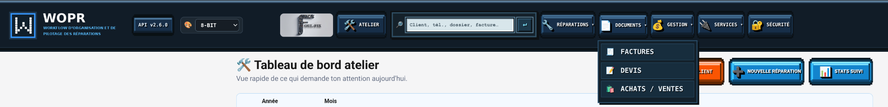

# WOPR - Manuel utilisateur

**Version documentée : 2.6.0**
**Documentation mise à jour : 30 septembre 2026**

**Workflow d’Organisation et de Pilotage des Réparations**

Développé par Foul-Fix, avec l’aide de ChatGPT (OpenAI) pour l’assistance au développement, à la documentation et aux tests.

---

## 1. Présentation

WOPR signifie **Workflow d’Organisation et de Pilotage des Réparations**.

WOPR est une application locale de gestion d’atelier destinée à centraliser dans une seule interface le cycle complet d’une réparation : réception du matériel, client, diagnostic, suivi technique, devis, facture, encaissement, restitution, documents, contacts, achats, justificatifs fournisseurs, licences antivirus et suivi administratif.

WOPR est né d’un besoin concret : éviter les doubles saisies, ne plus éparpiller les informations entre plusieurs fichiers et outils, retrouver immédiatement l’historique d’un client et conserver les documents au bon endroit.

WOPR fonctionne **en local**. L’application utilise un serveur Flask local et s’ouvre dans le navigateur. Le fonctionnement de base ne dépend pas d’un service cloud obligatoire.

### 1.1 Gratuit et open source

WOPR est distribué gratuitement par Foul-Fix et publié sous licence **GNU General Public License v3.0 (GPLv3)**.

Aucun paiement, abonnement ou don n’est nécessaire pour utiliser les fonctions de WOPR.

### 1.2 Plateformes

- **Linux : supporté**
- **Windows : supporté**
- **macOS : non supporté**

Pour macOS, aucun binaire officiel n’est fourni, aucun test de compatibilité n’est réalisé et aucun support de fonctionnement n’est garanti.

### 1.3 Soutenir WOPR

Le développement peut être soutenu volontairement via PayPal :

**https://paypal.me/foul**

[](https://paypal.me/foul)

Le don est totalement facultatif. Il ne débloque aucune fonctionnalité, ne donne accès à aucune version Premium et n’accorde aucun avantage dans le logiciel.

---

## 2. Principes de fonctionnement

WOPR repose sur quelques règles importantes.

- Le code distribuable se trouve dans la partie publique du projet.
- Les données réelles de l’atelier sont conservées dans `private/`.
- Les informations d’entreprise sont configurables localement et ne doivent pas être codées en dur dans le coeur public.
- Le **Suivi** est la source de vérité pour les montants de chiffre d’affaires.
- Les PDF sont des justificatifs : ils ne servent pas à recalculer automatiquement le CA.
- Les fonctions externes restent optionnelles.
- Les suppressions importantes doivent être explicites.
- L’archivage est préféré à la suppression pour les vrais clients.
- Les sauvegardes sont déclenchées automatiquement ou avant certaines opérations sensibles.

Cette séparation permet de publier le code de WOPR sans publier les données clients, factures, devis, signatures, mots de passe, jetons ou sauvegardes de l’atelier.

---

## 3. Installation et démarrage

### 3.1 Prérequis

WOPR utilise Python 3 et les dépendances déclarées dans `public/requirements.txt`.

Parmi les bibliothèques utilisées figurent notamment Flask, ReportLab, qrcode, Pillow, cryptography et les composants nécessaires à Google Contacts.

### 3.2 Linux

Le paquet officiel contient un binaire `WOPR` à la racine.

Au démarrage, le lanceur :

1. vérifie l’installation ;
2. prépare l’environnement Python si nécessaire ;
3. vérifie les dépendances ;
4. évite de lancer deux fois WOPR ;
5. démarre le serveur local ;
6. attend que le serveur soit prêt ;
7. ouvre l’application dans le navigateur.

### 3.3 Windows

Le paquet officiel contient `WOPR.exe`.

Le comportement est le même que sous Linux : environnement Python, contrôle des dépendances, protection contre les doubles lancements, démarrage du serveur puis ouverture du navigateur.

### 3.4 Adresse locale

Une fois démarré, WOPR est normalement accessible sur :

`http://127.0.0.1:5000`

### 3.5 Arrêt et sauvegarde

Le lanceur permet d’arrêter proprement WOPR.

Une sauvegarde d’arrêt n’est créée que si la base a changé depuis la sauvegarde précédente. Cela évite de générer inutilement des copies identiques.

Au démarrage, WOPR utilise la base officielle `private/data/wopr.db`.

---

## 4. Interface générale et thèmes

La barre principale est regroupée par centres d’intérêt afin de rester compacte, même sur les écrans moins larges :

- **Atelier** : accès direct au tableau de bord ;
- **Recherche globale** : recherche directe dans WOPR ;
- **Réparations** : **Suivi** et **Stock** ;
- **Documents** : **Factures**, **Facture simple**, **Devis** et **Achats / Ventes** ;
- **Gestion** : **CA / Déclarations**, **Antivirus** et **Clients** ;
- **Services** : **SumUp** et **Abby** ;
- **Sécurité** : accès direct aux réglages de sécurité et sauvegardes ;
- **Verrou** : bouton conservé seul à l’extrémité droite.

Sur un ordinateur équipé d’une souris, les menus groupés s’ouvrent au survol. Le clic reste disponible comme solution de repli, notamment pour les interfaces tactiles.



### 4.1 Thèmes

WOPR propose quatre thèmes :

- **Normal**
- **Dark**
- **WOPR / Terminal**
- **8-BIT**

Le choix est mémorisé dans le navigateur.

### 4.2 Couleurs des actions

Les actions utilisent une logique commune :

| Couleur | Rôle |
| --- | --- |
| Bleu | Ouvrir, historique, PDF, impression |
| Vert | Envoyer, enregistrer, valider |
| Ambre | Modifier |
| Violet | Dossier, joindre, fusionner, action spéciale |
| Rouge | Supprimer |
| Neutre | Annuler |

### 4.3 Thème 8-BIT

Le thème 8-BIT conserve un rendu pixel-art cohérent pour les boutons, tableaux et badges, y compris sur les écrans haute résolution.

---

## 5. Tableau de bord Atelier

La page **Atelier** est la vue d’accueil opérationnelle.

Elle sert à voir rapidement :

- les dossiers en cours ;
- les réparations en attente de pièce ;
- les matériels terminés à restituer ;
- les factures impayées ;
- le montant des impayés ;
- le chiffre d’affaires encaissé du mois ;
- le nombre de réparations entrées dans le mois ;
- les dossiers terminés depuis plusieurs jours ;
- les dossiers actifs anciens à relancer ;
- les derniers dossiers modifiés.

Le bouton **Nouvelle réparation** est placé directement dans cette page.

Depuis la version 2.6.0, le tableau Atelier donne également accès à **Stats suivi en ligne**, qui affiche les consultations réelles du portail client.

Les cartes du tableau de bord sont cliquables lorsqu’un accès détaillé existe.

---

## 6. Nouvelle réparation

### 6.1 Recherche du client

Lors de la création d’une réparation, il est possible de rechercher un client existant par prénom, nom, société, téléphone ou e-mail.

La recherche est effectuée côté serveur et ne charge pas tout le carnet clients dans la page. Elle est volontairement permissive : quelques caractères au milieu d’un nom ou d’une société peuvent suffire.

Lorsqu’une fiche est choisie, ses coordonnées sont automatiquement reprises.

Une modification réelle des coordonnées marque le client « À synchroniser » pour Google Contacts. En revanche, ouvrir ou réutiliser une fiche sans changement ne modifie pas son état de synchronisation.

WOPR ne déclenche pas de synchronisation Google automatique depuis cette saisie.

### 6.2 Adresse et ville

Le code postal peut proposer automatiquement la ville à partir d’une base locale.

Si un code postal correspond à plusieurs communes, WOPR affiche les choix possibles. Il ne choisit pas arbitrairement une commune.

La saisie manuelle reste toujours possible.

Cette assistance est également utilisée dans les écrans de modification et dans la Facture simple.

### 6.3 Informations enregistrables

Une réparation peut notamment contenir :

- client et coordonnées ;
- entreprise ;
- date de réception ;
- appareil ;
- panne déclarée ;
- accessoires ;
- système ;
- diagnostic ;
- informations techniques ;
- état d’avancement ;
- mot de passe système protégé ;
- montant de prestation ;
- montant de marchandise ;
- modalités de remise ;
- remarques ;
- facturation ;
- encaissement ;
- signature ;
- documents associés.

### 6.4 Statuts

Les statuts permettent d’organiser le travail.

Exemples :

- Reçu
- Diagnostic
- En attente accord
- En attente pièce
- En réparation
- Terminé
- Restitué

Ils sont utilisés par le tableau de bord, le Suivi et certains filtres.

---

## 7. Suivi des réparations

Le **Suivi** est la vue centrale des réparations.

Les dossiers sont regroupés par année et par mois.

Il est possible de :

- rechercher un client ou un dossier ;
- filtrer les matériels à restituer ;
- ouvrir le dossier ;
- modifier une ligne ;
- accéder à la facture ;
- facturer ;
- consulter l’encaissement ;
- ouvrir le dossier documentaire ;
- exporter en CSV.

### 7.1 Rôle comptable

Le Suivi constitue la référence comptable interne utilisée pour le CA.

Les PDF ne sont pas analysés pour récupérer les montants.

### 7.2 Affichage des tableaux

Les tableaux larges restent utilisables sur des écrans 2K/4K grâce au défilement horizontal.

### 7.3 Documents

Les PDF générés sont affichés directement dans le navigateur lorsque cela est possible.

Le bouton **Dossier** ouvre le répertoire dans lequel le document est archivé.

### 7.4 Suivi client en ligne et statistiques

WOPR peut publier les informations autorisées vers un portail de suivi configuré par l’atelier.

L’URL du portail et celle de l’API sont configurables : aucun domaine particulier n’est imposé par WOPR.

Depuis la version 2.6.0, WOPR peut récupérer des statistiques privées de consultation du portail :

- vues aujourd’hui ;
- vues sur les 7 derniers jours ;
- vues du mois ;
- visiteurs distincts ;
- première consultation ;
- dernière consultation ;
- détail par code de suivi.

Une consultation n’est comptée que lorsqu’un code valide affiche réellement un dossier. Les adresses IP ne sont pas conservées en clair pour ces statistiques.

---

## 8. Facturation

### 8.1 Facture liée à un dossier

Une réparation peut être facturée à partir de sa fiche.

La facture peut contenir plusieurs lignes de prestation et de marchandise.

Une facture existante peut être modifiée sans recréer le dossier.

Lorsqu’une facture est créée depuis un suivi, WOPR préremplit la désignation à partir des informations techniques disponibles, sans imposer de prix.

La date de facture peut être corrigée indépendamment du numéro de facture.

Les remarques et le travail effectué restent rattachés au Suivi et ne sont pas supprimés par l’éditeur de facture.

Par défaut, une facturation normale est remise en **Facture + Suivi Papier**. Le mode e-mail reste un choix manuel.

La date comptable n’est renseignée automatiquement que lorsque **Paiement reçu** est explicitement coché.

### 8.2 Liste Factures

La page **Factures** permet :

- la recherche ;
- l’ouverture du PDF ;
- le choix de la langue ;
- l’impression ;
- la modification ;
- l’envoi ;
- l’ouverture du dossier d’archive.

### 8.3 PDF multilingues

Les documents peuvent être générés dans plusieurs langues selon le type de document :

- français ;
- anglais ;
- ukrainien ;
- espagnol ;
- allemand ;
- italien.

L’interface de WOPR reste en français.

### 8.4 Affichage inline

Les PDF sont ouverts dans le lecteur du navigateur au lieu d’être téléchargés automatiquement.

### 8.5 Facture simple

La Facture simple permet de créer une facture sans dossier de réparation complet.

Elle utilise la même recherche client que la prise en charge : recherche permissive, sélection d’une fiche existante et remplissage automatique des coordonnées.

Elle accepte les lignes de prestation et de marchandise et bénéficie également de l’aide code postal / ville.

### 8.6 Classement

Les factures sont classées dans :

`private/documents/Factures/YYYY/MM - Mois/`

---

## 9. Devis

La section **Devis** permet :

- de créer un devis ;
- d’ajouter des prestations et marchandises ;
- de modifier un devis ;
- de générer le PDF ;
- d’ouvrir les documents originaux associés ;
- d’envoyer le devis ;
- d’ouvrir son dossier ;
- de supprimer le devis.

Les fichiers supplémentaires liés à un même devis restent associés au devis concerné et ne sont pas considérés à tort comme des doublons.

### 9.1 Devis historiques

L’historique client peut retrouver certains anciens devis créés avant la liaison systématique par identifiant client.

Le rattachement automatique n’est effectué que lorsqu’il est non ambigu.

---

## 10. Clients et contacts

La page **Clients** centralise les fiches et coordonnées.

Fonctions disponibles :

- création directe d’un client, sans créer de suivi ni de facture ;
- recherche ;
- historique ;
- SMS / message ;
- modification ;
- fusion ;
- archivage ;
- restauration ;
- suppression volontaire des fiches de test ;
- import Google CSV ;
- import Proton VCF ;
- export Google CSV ;
- export Proton CSV ;
- export VCard ;
- synchronisation Google Contacts.

### 10.1 Actions compactes

Les boutons d’action sont organisés de façon compacte afin de réduire la largeur du tableau sans perdre les fonctions.

### 10.2 Archivage et suppression

Un vrai client ayant un historique doit normalement être **archivé**.

La suppression définitive est réservée aux fiches de test ou créées par erreur et demande une confirmation explicite.

Lorsqu’un client est relié à Abby, WOPR tente d’abord de supprimer le contact ou l’organisation correspondant chez Abby. Si Abby refuse la suppression ou devient indisponible, la suppression locale est annulée afin d’éviter un décalage silencieux entre les deux systèmes.

### 10.3 Historique

La fiche d’historique permet notamment de retrouver :

- dossiers ;
- factures ;
- devis ;
- dernière intervention ;
- dernier dossier ;
- dernière facture ;
- dernier devis ;
- éléments à surveiller.

### 10.4 Google Contacts

La synchronisation Google est volontairement prudente.

Les opérations **WOPR vers Google** et **Google vers WOPR** sont distinctes.

La création ou la modification locale d’un client ne déclenche pas d’écriture Google automatique. Une vraie modification place simplement la fiche dans l’état **À synchroniser**.

La suppression Google est explicite.

La synchronisation de masse évite de renvoyer inutilement tous les contacts déjà synchronisés.

Une progression et un résumé final indiquent ce qui a été effectué.

Après modification d’un client, la recherche et le contexte courant sont conservés.

---

## 11. Recherche globale

La recherche globale est accessible directement depuis la barre supérieure.

Elle accepte plusieurs mots et ignore les différences :

- d’accents ;
- de casse ;
- de ponctuation.

Elle peut rechercher dans différentes informations :

- noms et entreprises ;
- téléphones ;
- courriels ;
- numéros de dossier ;
- appareils ;
- problèmes ;
- diagnostics ;
- systèmes ;
- statuts ;
- accessoires ;
- factures ;
- devis ;
- lignes de devis ;
- opérations Achats / Ventes.

---

## 12. Achats / Ventes

La section **Achats / Ventes** sert au suivi des opérations et justificatifs.

Elle permet :

- d’ajouter une opération ;
- de rechercher ;
- de modifier directement une ligne ;
- de supprimer ;
- de joindre un justificatif ;
- d’ouvrir le justificatif d’un achat ;
- d’ouvrir la facture client d’une vente ;
- d’ouvrir le dossier correspondant ;
- de contrôler les liens cassés ;
- de consulter les archives annuelles.

### 12.1 Documents fournisseurs

Organisation officielle :

`private/documents/Fournisseurs/YYYY/MM - Mois/`

WOPR accepte différents formats de justificatifs selon les cas : PDF, XML ou image.

### 12.2 Recherche du bon justificatif

Pour éviter d’ouvrir une mauvaise facture, WOPR privilégie les critères les plus fiables.

Ordre général :

1. numéro de facture ;
2. nom original du document ;
3. ancien chemin si le nom reste cohérent ;
4. fournisseur + date si la correspondance est unique ;
5. recherche globale contrôlée.

Les anciennes conventions de nommage restent prises en compte lorsque cela est nécessaire.

### 12.3 Règle comptable

Les justificatifs n’ajoutent pas de CA.

Le chiffre d’affaires officiel reste issu du Suivi.

---

## 13. Stock composants

Le module **Stock** reste volontairement simple et orienté atelier.

Chaque fiche peut contenir :

- Composant / Référence ;
- Fonction ;
- Quantité ;
- Remarques ;
- Image.

Le module propose également :

- recherche instantanée ;
- ajustement rapide des quantités ;
- agrandissement des images ;
- export CSV ;
- export PDF ;
- recherche intégrée d’images ;
- aide à l’identification de la fonction électronique.

L’identification automatique reste une aide : l’utilisateur garde la main sur les informations enregistrées.

---

## 14. Abby

L’intégration **Abby** est optionnelle.

Selon la configuration et les possibilités du compte, WOPR peut notamment :

- mémoriser la configuration ;
- tester la connexion ;
- synchroniser et relier des clients ;
- supprimer chez Abby un client supprimé dans WOPR lorsqu’un lien Abby existe ;
- consulter les erreurs ;
- importer certaines factures fournisseurs électroniques ;
- détecter les doublons.

Les clés et paramètres Abby restent dans la partie privée.

---

## 15. Antivirus

La page **Antivirus** sert de registre pour les licences et renouvellements.

Pour chaque ligne, WOPR peut mémoriser :

- le client ;
- la date de mise en place ;
- le produit ;
- la date d’expiration ;
- le numéro de facture ;
- une information de licence ou remarque.

Des compteurs indiquent :

- les licences valides ;
- les licences à renouveler dans les 30 jours ;
- les licences expirées.

L’édition se fait directement dans la ligne.

---

## 16. CA / Déclarations

La page **CA / Déclarations** présente les valeurs nécessaires au suivi administratif.

Les montants automatiques proviennent du Suivi et des champs comptables associés.

Principe à retenir :

**un seul référentiel de CA = le Suivi**

Une correction d’un PDF ne doit donc pas être utilisée pour corriger le CA.

---

## 17. Communication client

WOPR peut préparer différents messages :

- suivi de réparation ;
- facture ;
- devis ;
- message libre.

Le salut utilisé par défaut est neutre :

`Bonjour,`

Selon la configuration, l’envoi peut utiliser :

- SMTP Proton pour l’e-mail ;
- KDE Connect pour le SMS ;
- un texte préparé à copier dans un autre service.

Tous les envois SMTP construits par WOPR utilisent la même signature e-mail locale lorsqu’elle est activée.

WOPR reste utilisable même si ces intégrations ne sont pas configurées.

---

## 18. Sécurité locale

La page **Sécurité** regroupe plusieurs fonctions sensibles.

### 18.1 PIN administrateur

Le PIN protège l’accès atelier.

Il est stocké sous forme de hash.

### 18.2 Base SQLCipher

La base principale `private/data/wopr.db` est chiffrée avec SQLCipher. La clé de chiffrement de la base est aléatoire et distincte du PIN administrateur.

Le launcher demande le PIN lorsque le déverrouillage de la base est nécessaire. Ce PIN n’est pas écrit sur disque : il peut être conservé uniquement en mémoire vive pendant la session du launcher afin d’être réutilisé lors de l’arrêt et de la sauvegarde.

### 18.3 Clé maître

Les secrets locaux peuvent être chiffrés.

La clé maître doit être conservée avec soin. Une clé maître perdue ne peut pas être reconstruite à partir de la documentation.

### 18.4 Mots de passe appareil

Lorsqu’un mot de passe système est enregistré dans un dossier, il n’est pas affiché directement dans le HTML.

Sa consultation utilise une action protégée.

### 18.5 SMTP

Les réglages SMTP et jetons restent locaux.

La signature e-mail commune est également stockée dans `private/` afin de ne pas intégrer l’identité ou les visuels de l’entreprise dans le code public.

### 18.6 Logo facture

Le logo choisi par l’utilisateur est enregistré dans `private/assets/`.

Il n’est pas inclus dans le coeur public du projet.

### 18.7 Diagnostic de portabilité

Le diagnostic vérifie notamment :

- le coeur public ;
- la structure privée ;
- les droits d’écriture ;
- la présence du lanceur source ;
- le binaire Linux ;
- le binaire Windows.

---

## 19. Sauvegardes

WOPR conserve un nombre limité de sauvegardes récentes afin d’éviter une croissance infinie du dossier.

Une sauvegarde manuelle reste disponible.

---

## 20. Organisation des documents

Les documents sont stockés dans la partie privée.

Organisation principale :

```text
private/
└── documents/
    ├── Devis/
    ├── Factures/
    │   └── YYYY/
    │       └── MM - Mois/
    ├── Fournisseurs/
    │   └── YYYY/
    │       └── MM - Mois/
    └── Suivi de réparation/
        └── YYYY/
            └── MM - Mois/
```

---

## 21. Organisation générale des données

Structure simplifiée d’une installation :

```text
WOPR/
├── WOPR
├── WOPR.exe
├── README.md
├── LICENSE
├── public/
│   ├── app.py
│   ├── requirements.txt
│   ├── launcher/
│   │   └── wopr_launcher.py
│   ├── templates/
│   └── static/
├── docs/
└── private/              # NE PAS PUBLIER
    ├── data/
    ├── documents/
    ├── signatures/
    ├── assets/
    └── seeds/
```

La partie `private/` appartient à l’installation et peut contenir des informations confidentielles.

---

## 22. Licence GNU GPLv3

WOPR est publié sous licence **GNU General Public License version 3**.

Le texte juridique complet se trouve dans le fichier `LICENSE` fourni avec le projet.

### 22.1 Gratuité de WOPR

La GPLv3 n’interdit pas en elle-même de demander de l’argent pour distribuer un logiciel.

**Foul-Fix choisit cependant de distribuer WOPR gratuitement.**

Il n’existe pas de version Premium et aucun don n’est requis pour accéder à une fonction.

---

## 23. Soutien PayPal

WOPR est gratuit.

Si l’utilisateur souhaite soutenir volontairement le projet :

**PayPal : https://paypal.me/foul**

[](https://paypal.me/foul)

Le soutien est facultatif.

Aucune fonctionnalité n’est bloquée sans don.

---

## 24. Publication sur GitHub

Avant une publication, vérifier impérativement qu’aucune donnée privée n’est incluse.

### À ne jamais publier

- `private/` ;
- bases SQLite réelles ;
- sauvegardes ;
- clés ;
- jetons ;
- secrets SMTP ;
- identifiants OAuth ;
- signatures ;
- factures et devis clients réels ;
- exports clients ;
- captures non anonymisées.

### Publication

Avant toute publication, vérifier la cohérence de la version, la documentation, les ressources publiques et l’absence de données privées.

---

## 25. Dépannage rapide

### WOPR ne démarre pas

Vérifier Python, les dépendances, le lanceur, les messages affichés au démarrage et les fichiers présents dans l’installation.

### Une intégration externe ne fonctionne pas

Google, Abby, SMTP, KDE Connect et le suivi public nécessitent leur propre configuration.

### Le CA semble incohérent

Contrôler le Suivi, les montants et les dates d’encaissement.

---

## 26. Nouveautés principales de la release 2.5.0

La version 2.5.0 renforce principalement la sécurité locale, la compatibilité Linux / Windows et la stabilité de l’interface.

- base principale chiffrée avec SQLCipher ;
- clé SQLCipher aléatoire et distincte du PIN ;
- PIN conservé uniquement en mémoire vive pendant la session du launcher ;
- fonctionnement Linux / Windows harmonisé ;
- interface 8-BIT stabilisée.

## 27. Nouveautés principales de la release 2.5.1

La version 2.5.1 est une release de maintenance de la série 2.5.x.

- corrections CA et rapprochement SumUp ;
- filtres Atelier fiabilisés ;
- remarques du suivi public enrichies ;
- stabilité du Mode Client et du launcher conservée.

## 28. Nouveautés principales de la release 2.6.0

La version 2.6.0 ajoute plusieurs évolutions importantes au travail quotidien de l’atelier.

### Navigation et ergonomie

- nouvelle barre supérieure groupée par centres d’intérêt ;
- menus **Réparations**, **Documents**, **Gestion** et **Services** ;
- ouverture des menus au survol avec une souris, clic conservé en secours ;
- **Sécurité** accessible directement sans sous-menu intermédiaire ;
- bouton de verrouillage isolé à droite ;
- **Gestion** regroupe les fonctions internes : CA / Déclarations, Antivirus et Clients ;
- **Services** regroupe les services externes : SumUp et Abby ;
- affichage direct des dix dernières sauvegardes locales dans la page Sécurité.

### Stock composants

- ajout d’un module Stock simple : référence, fonction, quantité, remarques et image ;
- recherche instantanée ;
- ajustement rapide des quantités ;
- aperçu des images ;
- export CSV et PDF ;
- recherche d’images directement depuis WOPR ;
- aide à l’identification de la fonction électronique d’un composant.

### Statistiques du suivi client

- comptage des consultations réelles du portail de suivi ;
- une consultation est enregistrée uniquement lorsqu’un code valide affiche un dossier ;
- vues aujourd’hui, sur 7 jours et sur le mois ;
- visiteurs distincts ;
- première et dernière consultation ;
- détail par code de suivi ;
- rapprochement du code public avec le dossier et le client locaux ;
- accès depuis le tableau de bord Atelier ;
- aucune adresse IP conservée en clair dans les statistiques.

La version 2.6.0 conserve également les correctifs de la série 2.5.1 concernant le CA, SumUp, les filtres Atelier, le suivi public et le Mode Client.

## 29. Crédit

**Développé par Foul-Fix, avec l’aide de ChatGPT (OpenAI) pour l’assistance au développement, à la documentation et aux tests.**

WOPR est développé comme un outil métier de terrain, avec une priorité donnée à la simplicité d’utilisation, à la portabilité, à la conservation locale des données sensibles et à la réduction des doubles saisies.
